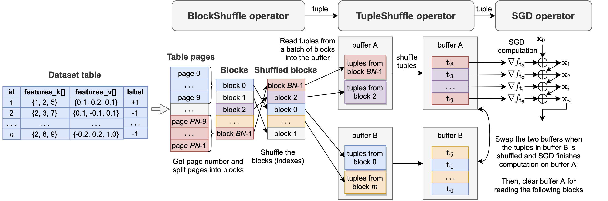
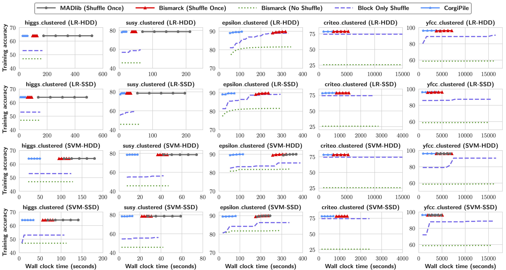
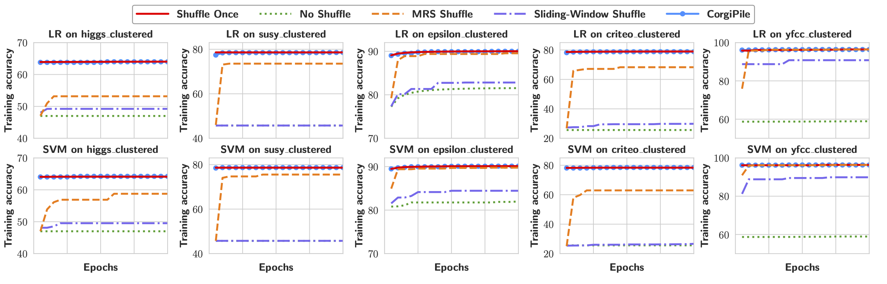
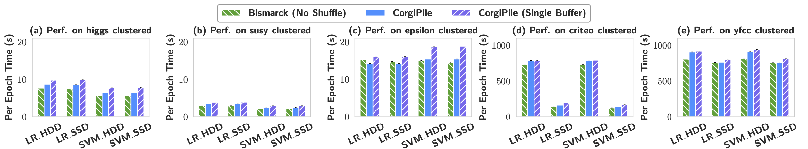

# In-Database Machine Learning with CorgiPile: Stochastic Gradient Descent without Full Data Shuffle


# Introduction
CorgiPile is a novel *two-level hierarchical* data shuffle mechanism for efficient SGD in DB systems. CorgiPile first samples and shuffles data at the *block-level*, and then shuffles data at the *tuple-level* within the sampled data blocks, i.e., firstly shuffling data blocks (a batch of table pages per block), and then merging sampled blocks in a buffer, and finally shuffling tuples in the buffer for SGD.
Compared with existing mechanisms, CorgiPile can avoid the full shuffle while maintaining comparable convergence rate as if a full shuffle was performed.

We have implemented CorgiPile inside PostgreSQL, with three new inherent physical operators.
Extensive experimental results show that our CorgiPile in PostgreSQL
can achieve comparable convergence rate with the full-shuffle based SGD, and 2.X-12.8X faster than the state-of-the-art in-DB ML systems including Apache MADlib and Bismarck, on both HDD and SSD.


# Implementation in PostgreSQL

The following figure illustrates the implementation of CorgiPile with new operators and double-buffer optimization, in PostgreSQL.



The query, control flow and iteration paradigm of CorgiPile in PostgreSQL is as follows.
```SQL
Query: SELECT * FROM table_name TRAIN BY model_name WITH params = args;
```
```c++
// Query plan: ExecSGD => ExecTupleShuffle => ExecBlockShuffle 

/************************
 *  SGD operator 
************************/
void ExecInit():
   initialize the ML model;
    
Model ExecSGD():
   for each epoch:
      /* training */
      while(true):
         pull a tuple i from TupleShuffle operator;
         if (tuple i is not null):
            compute the gradient g of tuple i;
            update model with g;
         else:
            break;
      ExecReScan();
   return trained model;
    
void ExecReScan():
   invoke TupleShuffle.ExecReScan();

/************************
 * TupleShuffle operator
************************/
void ExecInit(): 
   initialize buffer and I/O offsets;
   
Tuple ExecTupleShuffle():
   if (buffer is empty):
      pull tuples from previous BlockShuffle operator
           one by one until the buffer is filled;
      shuffle tuples in the buffer;
   else:
      return buffer[offset++];
      
void ExecReScan():
   clear the buffer and I/O offsets;
   invoke BlockShuffle.ExecReScan();

/************************
 * BlockShuffle operator
************************/
void ExecInit(): 
   compute the total block number;
   shuffle the block indexes;
   
Tuple ExecBlockShuffle():
   for each shuffled block i:
      for each page j in the block i:
         read a tuple k from the page j;
         return tuple k;
            
void ExecReScan():
   re-shuffle the block indexes;
   clear I/O offsets;

```

In our current implemention, the source code of the three operators are available at 
[SGD operator with SGD computation](src/backend/executor/nodeLimit.c),
[TupleShuffle operator](src/backend/executor/nodeSort.c) with its [TupleShuffle implementation](src/backend/utils/sort/tuplesort.c), and
[BlockShuffle operator](src/backend/executor/nodeSeqscan.c) with its [BlockShuffle implementation](src/backend/access/heap/heapam.c).


# CorgiPile Performance

## Datasets

The datasets used in our experiments are avaialbe [here](datasets_intro.md).

## End-to-end exeuction time
The end-to-end execution time of SGD with different data shuffle strategies in PostgreSQL, for clustered datasets on HDD and SSD. 

From this Figure, we can observe that *CorgiPile* converges the fastest among all systems, and can simultaneously achieve comparable converged accuracy to the best *Shuffle Once* baseline,
usually within 1-3 epochs due to the large number of data tuples. 
Compared with the *Shuffle Once* strategy in MADlib and Bismarck, *CorgiPile* converges 2.9X-12.8X faster than MADlib and 2X-4.7X faster than Bismarck, on HDD and SSD. This is due to the eliminated data shuffling time. 




## Convergence rates
The following Figure shows the convergence behavior of all strategies, where *Sliding-Window Shuffle*, *MRS Shuffle*, and *CorgiPile* all use the same buffer size (10% of the dataset). As shown in this Figure, *Sliding-Window Shuffle* suffers from a lower converged accuracy, whereas *MRS Shuffle* can achieve an accuracy comparable to *Shuffle Once* only on yfcc but suffers from a lower accuracy on the other datasets. 




## Per-epoch exeuction time
The following Figure presents the results of *No Shuffle* and *CorgiPile*, as well as the single-buffer version of *CorgiPile*.

We make the following three observations:
* For small datasets with in-memory I/O bandwidth, the average time per epoch of *CorgiPile* is comparable to that of *No Shuffle*. 
* For large datasets with disk I/O bandwidth, the average per-epoch time of *CorgiPile* is up to 1.1X slower than that of *No Shuffle*, i.e., it incurs at most an additional 11% overhead, due to buffer copy and tuple shuffle. 
* By using double-buffering optimization, *CorgiPile* can achieve up to 23.6% shorter per-epoch execution time.



